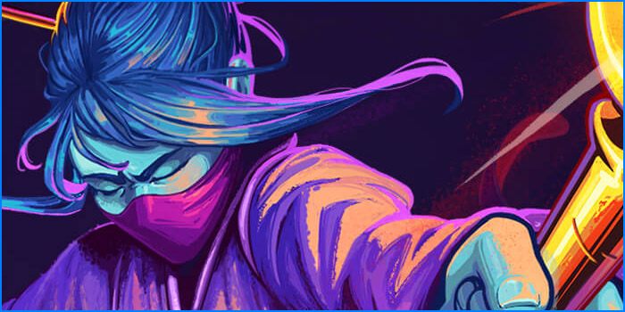

# 🧙‍♂️ Proyecto simulacion de combate  

Bienvenido a mi proyecto **simulacion de combate** basado en el famoso juego RPG de cartas y mazmorras desarrollado por MegaCrit y publicado por Humble Bundle.
Este proyecto lo estoy realizando en el curso Laboratorio Avanzado de Programacion de la carrera Desarrollo de Software de la UDC (Universidad del Chubut).

---
## 📁 Estructura del proyecto

proyecto/ 
│ ├── modelo.py #Contiene la lógica de las clases y personajes 
├── main.py #Simula el combate entre personajes 
└── README.md #Este archivo

## 📁 Requisitos

Antes de comenzar, asegúrate de tener instalados los siguientes requisitos:

- Python 3.8 o superior
- Visual Studio Code o cualquier editor de codigo
- pip (gestor de paquetes de Python)

---

## 📁 Instalación

Sigue estos pasos para instalar el proyecto:

1. **Clona el repositorio:**

   ```bash
   git clone https://github.com/KORATcs/juego.git
2. **Ejecuta el archivo main.py desde la terminal:**
    ```bash
    python main.py

## Clases y Funcionalidades

Personaje

Clase base que contiene:

    atacar(Personaje): Ataca a otro personaje y suma 1 de maná.

    ataque_especial(): Acción única que varía según el tipo de personaje (debe sobreescribirse).

    concentrar(): Gana 2 de maná al instante.

    estado(): Verifica si está vivo o muerto.

    estadisticas(): Muestra su nombre, vida, daño y maná.

## ⚔️ Mecanicas de la simulacion de combate

  Los personajes atacan si están vivos.

    Cada ataque suma 1 de maná.

    Al llegar a 3 de maná, el personaje debe usar su ataque especial.

    El daño total se calcula como:
    daño_total = daño_atacante - defensa_objetivo

    Si el daño es menor o igual a 0, no se inflige daño.

    Si la vida llega a 0, el personaje se considera muerto y no puede seguir combatiendo.

## 💡 Ejemplos de uso 

    from modelo import Personaje, la_vigilante, devorador_del_tiempo

    guerrero = la_vigilante("La Vigilante", 20, 9, 8)
    enemigo = devorador_del_tiempo("Devorador del Tiempo", 50, 15, 0)

    guerrero.atacar(enemigo)

## 💡 Mejoras futuras

    Más personajes con habilidades únicas.

    Combates por turnos.

    Interfaz gráfica (GUI o consola interactiva).

    Sistema de niveles y experiencia.  


